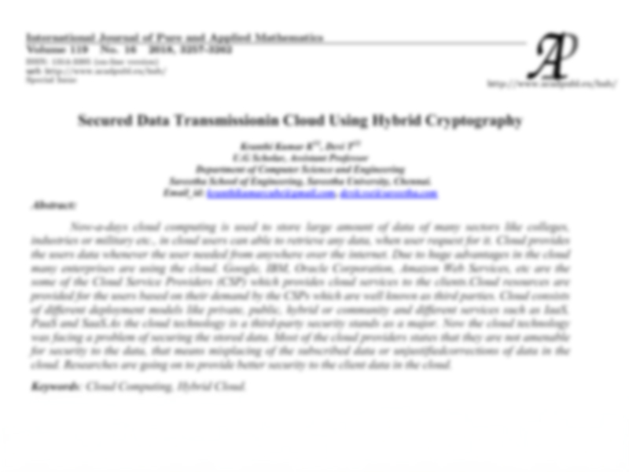
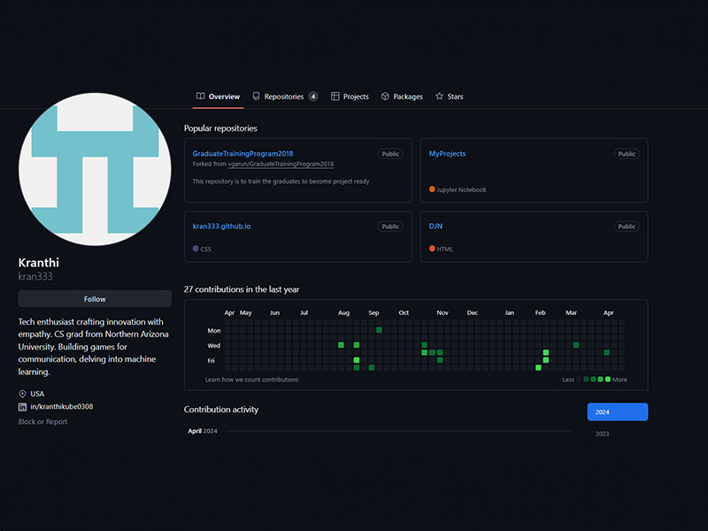
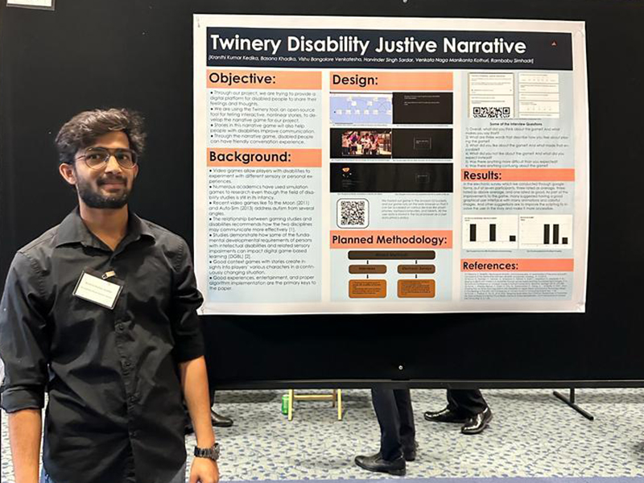

# Kranthi's Portfolio

## Navigation

- [Home](#section-home)
- [About](#section-about)
- [Skills](#section-portfolio)
- [Experience](#section-experience)
- [Education](#section-education)
- [Achievements](#section-achievements)
- [Contact](#section-contact)

---

## Home

### Hello, I'm  
# Kranthi Kumar Kedika
**and this is My Portfolio**

---

## About Me

### About **Me**

Software Engineer with over 3 years of professional experience in software development and Data Analytics. Expertise in various programming languages such as Python, Java, JavaScript, SQL, and AWS. Proficient in Object-Oriented Programming with expertise in Multi-Threading, Exception Handling, and Collections for designing robust solutions. Experience using code management platforms like Bitbucket and GitHub to migrate source code across branches.

[View Resume](https://drive.google.com/file/d/1pohGUJUzzy57r6SZvQNwznflUnzNXZnm/view?usp=sharing)

---

## Featured Skills

- **Technical Skills**
  - Programming Languages: Python, Java, SQL, JavaScript, Unix, OOPS, Algorithms, Git
  - Cloud Services: AWS, Google Cloud, Microsoft Azure
  - Machine Learning: Tensorflow (Basics)

- **Soft Skills**
  - Interpersonal Skills: Problem Solving, Excellent Communication, Teamwork, Adaptability

- **Certifications**
  - AWS Training and Certification: AWS Certified Developer – Associate
  - Google Cloud Certification: Google Cloud Certified - Associate Cloud Engineer
  - Issued by DataCamp: Training Accomplishments

---

## My Experience

**September 2019 - December 2021**

### Software Engineer | Accenture

_Chennai, India._

As an experienced developer and data analyst, I excel in integrating RESTful APIs for efficient data retrieval and crafting intuitive reporting modules using HTML5, CSS3, Angular, ReactJS, and jQuery. I specialize in creating dynamic single-page applications with Angular and Node JS, collaborating closely with AWS for seamless integration. My expertise in data analysis, demonstrated through Jupyter Notebooks, has led to significant improvements in forecasting accuracy and operational efficiency. I optimize data pipelines and SQL queries for faster execution, manage multi-environment setups, troubleshoot data issues, and utilize Linux/Unix for database management. Additionally, I create interactive dashboards in PowerBI and Tableau, reducing reporting time.

**December 2018 - August 2019**

### Associate Software Engineer | Accenture

_Chennai, India._

I excelled in Agile development, collaborating closely with stakeholders to refine business requirements. I optimized data pipelines, reducing processing time by 20% and improving data accuracy by 15%. Additionally, I led the implementation of a versatile multi-environment setup, streamlining development and deployment procedures.

---

## My Education

**January 2022 - May 2023**

### Master of Computer Science

Northern Arizona University, Flagstaff, Arizona.

Relevant Coursework: Advanced Intelligent Systems, Contemporary Developments (Accessible Games for Health), Applied Cryptography, Applied Business Intelligence, Statistical Methods I, Software Assurance.

GPA: 3.10/4.00

[Transcripts](https://drive.google.com/file/d/1h8WkRTWBa7EahNBRXds-qubNXO-b1iZJ/view?usp=sharing) | [eDiploma](https://drive.google.com/file/d/1OGnvXGa7QQeP9Uzoa4gAyhRqLRfIFUBk/view?usp=sharing)

**August 2014 - May 2018**

### Bachelor of Computer Science

Saveetha School of Engineering, Chennai, India.

CGPA: 7.33/10

[Transcripts](https://drive.google.com/file/d/1V9_r5ke7yq31RIwHudzogTSzPBL8WYCi/view?usp=sharing)

---

## My Achievements Anthology

**Publications**

Secured Data Transmission in Cloud Using Hybrid Cryptography.

I worked with my professor, Devi T, to develop a new cryptography technique that enhances cloud infrastructure security. We published a paper in the "International Journal of Pure and Applied Mathematics" 2018. Our approach employs a combination of symmetric and asymmetric encryption algorithms known as Hybrid Cryptographic methods to maximize security.

_August, 2018._

**Projects**

Check out my GitHub profile to explore my projects firsthand. Witness the depth of my coding expertise and creativity in action.

**Awards**

During my time at NAU, I led a team of three in creating an interactive narrative game called "Disability Justice Twinery Narrative." The game won second place at Engineering FEST-1 and provided a platform for improving communication skills for people with disabilities.

_December_
